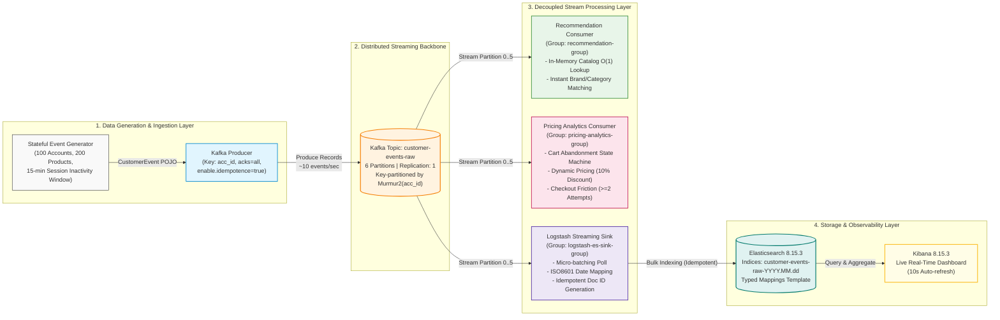

# Real-Time E-Commerce Customer Tracking & Stream Analytics Platform

[](https://www.oracle.com/java/)
[](https://kafka.apache.org/)
[](https://www.elastic.co/elasticsearch/)
[](https://www.elastic.co/logstash/)
[](https://www.elastic.co/kibana/)
[](https://www.docker.com/)

An enterprise-grade, distributed real-time streaming data platform designed to capture, process, analyze, and visualize high-throughput customer clickstream events for modern e-commerce ecosystems. 

The platform implements **stateful sessionization**, **strict per-account partition ordering**, **idempotent stream processing**, **real-time product recommendations**, **dynamic pricing & funnel analytics**, and automated **ELK Stack real-time ingestion & visualization**.

---

## 1. System Architecture



---

## 2. Core Data Engineering Highlights

### 🔹 Partition Routing & Strict Per-Account Ordering
- **Murmur2 Hashing**: Every `CustomerEvent` designates `acc_id` as the Kafka message key.
- **Strict FIFO Ordering**: All clickstream events originating from the same customer account are guaranteed to land on the exact same Kafka partition. This preserves strictly ordered state transitions (`VIEW` $\rightarrow$ `ADD_TO_CART` $\rightarrow$ `CHECKOUT` $\rightarrow$ `PURCHASE`) without race conditions across distributed consumer instances.

### 🔹 Stateful Sessionization Algorithm
- Implements an internal `AccountState` tracker managing `currentSessionNumber` and `lastEventTime`.
- **15-Minute Inactivity Boundary**: If an account does not emit any action for 15 minutes, the current session automatically terminates and rolls over to a newly sequenced session ID (`SS00000001`, `SS00000002`, ...), mirroring real-world e-commerce user behavior.

### 🔹 Idempotency & Exactly-Once Semantics (EOS)
- **Producer-Side Guarantee**: Built with `enable.idempotence=true`, `acks=all`, and `max.in.flight.requests.per.connection=5`, preventing duplicate records caused by network retries.
- **Consumer/Storage-Side Deterministic ID**: In Logstash, each document is assigned a unique deterministic identifier:
  ```ruby
  document_id => "%{acc_id}_%{session_id}_%{event_time}"
  ```
  Even if Logstash replays batches from `auto_offset_reset => "earliest"`, Elasticsearch safely performs an **upsert** operation instead of duplicate insertions, achieving end-to-end zero data distortion.

### 🔹 Decoupled Multi-Consumer Ecosystem
- Employs independent Kafka **Consumer Groups** (`recommendation-group`, `pricing-analytics-group`, `logstash-es-sink-group`).
- Each consumer group maintains its own committed offset, allowing real-time recommendation engines, pricing state machines, and search indexers to scale, restart, or failover without impacting other downstream systems.

---

## 3. Stream Processing & Business Use Cases

| Business Module | Trigger Event(s) | Detection Logic | Automated Business Action |
| :--- | :--- | :--- | :--- |
| **Real-Time Recommendation Engine** | `VIEW`, `CLICK`, `SEARCH` | In-memory lookup ($O(1)$) across 200 catalog products indexed by `category_id` and `brand_id`. | Instantly surfaces top 5 relevant items (prioritizing identical categories, then identical brands). |
| **Dynamic Pricing (Cart Abandonment)** | Any action in a subsequent session (`currentSession > startSession`) | Cross-session retention check for unpurchased `ADD_TO_CART` / `WISHLIST` items. | Flags `[DYNAMIC PRICING ACTIVATED]` and triggers an instant 10% Extra Discount coupon. |
| **Checkout Friction & Voucher Hunting** | `CHECKOUT` | Stateful counter detects $\ge 2$ checkout attempts without a successful `PURCHASE`. | Emits `[ALERT - CHECKOUT FRICTION]` to push a 20k Voucher/FreeShip incentive to close the deal. |
| **Conversion & Cart Cleanup** | `PURCHASE`, `REMOVE_FROM_CART` | Matches tracked `acc_id_product_id` keys in `stateMap`. | Logs conversion success metrics, records checkout iteration cycles, and releases RAM state. |

---

## 4. Technology Stack

| Layer | Component | Technology | Version | Purpose |
| :--- | :--- | :--- | :--- | :--- |
| **Language** | Core Runtime | Java OpenJDK | 17 | Core streaming application runtime |
| **Build & Dependencies** | Build Tool | Apache Maven | 3.9+ | Dependency and packaging lifecycle management |
| **Streaming Backbone** | Event Broker | Apache Kafka | 3.7.0 (Clients 3.7.0) | High-throughput distributed message log (6 partitions) |
| **Serialization** | JSON Engine | Jackson Databind | 2.17.0 | Strict `@JsonPropertyOrder` & snake_case DB schema mapping |
| **Logging** | Observability | SLF4J + Logback | 2.0.12 / 1.5.3 | Structured, level-based console & file logging |
| **Boilerplate** | Productivity | Project Lombok | 1.18.32 | Clean POJOs (`@Data`, `@Builder`, `@Slf4j`) |
| **ETL Ingestion** | Log Pipeline | Elastic Logstash | 8.15.3 | Kafka consumer micro-batching & Elasticsearch indexing |
| **Search & Storage** | Distributed Search | Elasticsearch | 8.15.3 | Real-time indexed document datastore |
| **Visualization** | BI & Dashboards | Kibana | 8.15.3 | Real-time live analytics dashboards & Discover exploration |
| **Containerization** | Infrastructure | Docker & Compose | Latest | Orchestration for Kafka, Zookeeper, and ELK Stack |

---

## 5. Repository Structure

```text
customer-tracking-pipeline/
├── pom.xml                                     # Maven build definition & dependencies
├── es-template.json                            # Elasticsearch index template with explicit mappings
├── logstash-kafka-es.conf                      # Logstash pipeline configuration (Kafka -> ES)
├── src/
│   ├── main/
│   │   ├── java/com/tracking/
│   │   │   ├── CustomerTrackingApp.java        # Main Orchestrator (Producer + Multi-Consumer Threads)
│   │   │   ├── consumer/
│   │   │   │   ├── PricingAnalyticsConsumer.java # Dynamic pricing & checkout friction state machine
│   │   │   │   └── RecommendationConsumer.java  # Real-time category/brand product recommendation
│   │   │   ├── generator/
│   │   │   │   └── CustomerEventGenerator.java # Stateful sessionization clickstream generator
│   │   │   ├── model/
│   │   │   │   ├── CustomerEvent.java          # Canonical Jackson-ordered event model
│   │   │   │   └── Product.java                # Product catalog data model
│   │   │   ├── producer/
│   │   │   │   └── CustomerEventProducer.java  # Idempotent Kafka producer with key-based routing
│   │   │   └── repository/
│   │   │       └── ProductCatalogRepository.java # O(1) in-memory catalog index & recommendation engine
│   │   └── resources/
│   │       ├── logback.xml                     # Logback log layout & formatting
│   │       └── products.csv                    # Catalog master dataset (200 products)
│   └── test/
│       └── java/com/tracking/
│           ├── consumer/
│           │   └── PricingAnalyticsConsumerTest.java # Unit tests for all 5 business state branches
│           ├── generator/
│           │   └── CustomerEventGeneratorTest.java  # Distribution & session consistency tests
│           └── model/
│               └── CustomerEventTest.java           # Strict JSON serialization order validation
└── README.md                                   # Comprehensive project documentation
```

---

## 6. Getting Started & Setup Guide

### Prerequisites
- **Java Development Kit (JDK)**: Version 17+
- **Apache Maven**: Version 3.8+
- **Docker & Docker Compose**: Installed and running
- **Git**

---

### Step 1: Launch Infrastructure Containers
Ensure your Kafka and ELK containers are running and bridge Logstash to Kafka's Docker network:

```powershell
# 1. Connect Logstash container to Kafka Docker network
docker network connect kafka-stack-docker-compose_default ecomflow-logstash
```

Verify that the following endpoints are accessible:
- **Kafka Broker**: `localhost:9092` (Host) / `kafka1:19092` (Docker internal)
- **Elasticsearch**: `http://localhost:9200`
- **Kibana**: `http://localhost:5601`

---

### Step 2: Apply Elasticsearch Index Template
To prevent Elasticsearch from incorrectly guessing date fields as loose text, submit the explicit index template:

```powershell
curl.exe -s -X PUT "http://localhost:9200/_index_template/customer_events_template" `
  -H "Content-Type: application/json" `
  --data-binary @es-template.json
```
*Expected response:* `{"acknowledged": true}`

---

### Step 3: Configure and Deploy Logstash Pipeline
Ensure `logstash-kafka-es.conf` is loaded into Logstash:

```powershell
# Copy pipeline config to Logstash bind-mount path or container
docker restart ecomflow-logstash

# Inspect logs to confirm consumer group assignment
docker logs ecomflow-logstash --tail 50
```
*Expected log:* `Successfully joined group with generation ... Finished assignment for group ... [customer-events-raw-0 .. 5]`

---

### Step 4: Run the Java Streaming Pipeline
Run the consolidated orchestrator directly from your IDE or Maven terminal:

```powershell
mvn clean compile
mvn exec:java -Dexec.mainClass="com.tracking.CustomerTrackingApp"
```

The application initiates:
1. `CustomerEventProducer` emitting ~10 events/second with key hashing.
2. `RecommendationConsumer` printing real-time catalog recommendations.
3. `PricingAnalyticsConsumer` actively monitoring cart abandonment & checkout friction.
4. JVM Shutdown Hook registered for graceful exit on `Ctrl + C`.

---

### Step 5: Configure Kibana Live Dashboard
1. Open your browser and navigate to **[http://localhost:5601](http://localhost:5601)**.
2. Navigate to **Management** $\rightarrow$ **Data Views** (A pre-configured view `Customer Tracking Events` matching `customer-events*` with `@timestamp` will already be active).
3. Access **Discover** ([http://localhost:5601/app/discover](http://localhost:5601/app/discover)) and set the time filter to **Last 24 Hours** or **Last 7 Days**.

---

## 7. Monitoring, Verification & Live Dashboard

### 🔍 Verification Commands

**1. Check Elasticsearch Cluster Health:**
```powershell
curl.exe -s "http://localhost:9200/_cluster/health?pretty"
```

**2. Inspect Streamed Indices and Document Counts:**
```powershell
curl.exe -s "http://localhost:9200/_cat/indices/customer-events*?v"
```

**3. Retrieve Latest Streamed Document:**
```powershell
curl.exe -s "http://localhost:9200/customer-events*/_search?size=1&pretty"
```

---

### 📊 Recommended Kibana Visualizations

| Widget Name | Chart Type | Dimensions & Metrics | Business Value |
| :--- | :--- | :--- | :--- |
| **Event Ingestion Velocity** | Area / Date Histogram | X-Axis: `@timestamp` (1m interval)<br>Y-Axis: `Count()` | Monitors ingestion throughput and pipeline health in real time. |
| **E-Commerce Conversion Funnel** | Horizontal Bar / Donut | Dimension: `event_type.keyword`<br>Breakdown: VIEW $\rightarrow$ ADD_TO_CART $\rightarrow$ CHECKOUT $\rightarrow$ PURCHASE | Identifies drop-off rates across stages of the buying journey. |
| **Top Trending Products** | Ranked Table / Bar | Dimension: `product_id.keyword` (Top 10)<br>Metric: `Count()` | Surfaces highly engaged inventory for demand forecasting. |
| **Client Device Distribution** | Pie Chart | Dimension: `device_type.keyword`<br>Metric: `Percentage()` | Analyzes platform adoption (Desktop, Mobile, Tablet) for UX optimization. |

---

## 8. License & Attribution

Developed as an **Enterprise Big Data & Real-Time Stream Engineering Showcase**. Distributed under the Apache 2.0 License.
